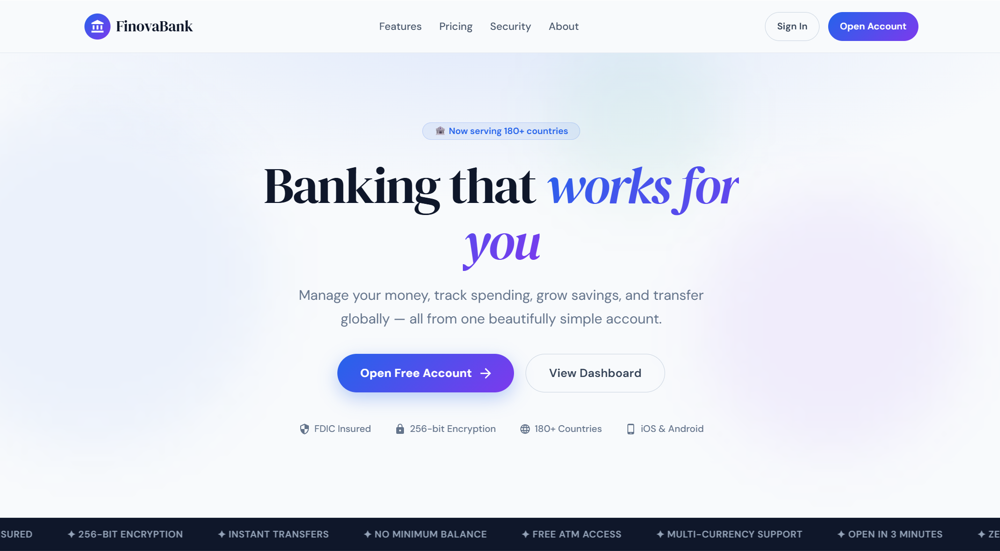

# FinovaBank


## Digital Banking Platform

FinovaBank is a digital banking platform built as genuine Java microservices: a Eureka service registry, a Spring Cloud Gateway, and ten independent Spring Boot services covering auth, accounts, transactions, loans, savings goals, reporting, notifications, and security. Three Python/Flask AI services (fraud scoring, risk assessment, and compliance) are also genuinely routed through the same gateway under `/api/ai`, `/api/risk`, and `/api/compliance`, so the whole platform is reachable through one unified API surface.

<div align="center">
  
</div>

## Table of Contents

- [Overview](#overview)
- [Project Structure](#project-structure)
- [Feature Status](#feature-status)
- [Technology Stack](#technology-stack)
- [Architecture](#architecture)
- [Installation and Setup](#installation-and-setup)
- [Running the Stack](#running-the-stack)
- [API Surface](#api-surface)
- [Testing](#testing)
- [CI/CD Pipeline](#cicd-pipeline)
- [Documentation](#documentation)
- [Contributing](#contributing)
- [License](#license)

## Overview

FinovaBank demonstrates a digital banking workflow across a real, runnable set of Java and Python microservices, with substantial test suites on both sides (dozens of JUnit test files across the ten Java services). There is no blockchain code anywhere in this repository: no Solidity contracts, no Hyperledger or Ethereum client libraries, and nothing in either frontend references web3 or ethers. "Fraud detection" and "risk scoring" are real, deterministic, rule-based scoring engines (weighted feature checks) rather than trained machine learning models.

## Project Structure

```
FinovaBank/
├── code/
│   ├── backend/                                # Java microservices (Maven multi-module)
│   │   ├── eureka-server/                      # Service registry
│   │   ├── api-gateway/                        # Spring Cloud Gateway, routes to all 13 services
│   │   ├── auth-service/                       # Registration, login, JWT
│   │   ├── security-service/                   # Encryption and auth utilities (no REST API of its own)
│   │   ├── account-management/                 # Account creation and management
│   │   ├── transaction-service/                # Transfers, transaction history
│   │   ├── loan-management/                    # Loan applications and management
│   │   ├── savings-goals/                      # Savings goal tracking
│   │   ├── reporting/                          # Report generation
│   │   ├── notification-service/               # Sending notifications
│   │   └── common (shared config, resources)
│   └── ml-services/                            # 3 independent Python/Flask services, routed
│       ├── ai-service/                         # Fraud detection, recommendations, analytics
│       ├── risk-assessment/                    # Risk scoring
│       └── compliance-service/                 # Compliance, audit, reporting
├── web-frontend/                               # React (TypeScript) dashboard
├── mobile-frontend/                            # React Native (Expo Router, TypeScript) app
├── infrastructure/                             # Docker, Kubernetes, Terraform, Ansible, monitoring
├── scripts/                                    # finovabank.sh (build/start/stop/list/frontend)
│                                               # and other setup, deploy, and test scripts
├── docs/                                       # Documentation (this directory)
└── README.md
```

## Feature Status

### Application tier (wired and tested)

| Component                          | Details                                                                                                                                                                                                                                                                                       |
| :--------------------------------- | :-------------------------------------------------------------------------------------------------------------------------------------------------------------------------------------------------------------------------------------------------------------------------------------------- |
| **Service registry and gateway**   | A real Eureka server, with a Spring Cloud Gateway that routes all 13 services (10 Java, 3 Python) under a single `/api` surface, using Eureka's load balancer for the Java services and direct URIs for the Python ones.                                                                      |
| **Auth**                           | JWT issuance and validation in `auth-service`. The signing key falls back to a hardcoded default if `JWT_SECRET` is unset; the local development profile uses a value explicitly named for that purpose, but the default profile's fallback is not obviously marked as unsafe for production. |
| **Core banking services**          | Nine further Java services: accounts, transactions, loans, savings goals, reporting, and notifications, each with its own controller, service layer, and JUnit test suite.                                                                                                                    |
| **Security service**               | Encryption and authentication-flow utilities with their own tests, registered with Eureka; it has no REST controller of its own, so it isn't reachable as an API in its own right.                                                                                                            |
| **Fraud detection**                | A deterministic, rule-based scoring engine in `ai-service`: transaction features are extracted and combined into a weighted risk score, not a trained classifier.                                                                                                                             |
| **Risk assessment and compliance** | Two further Flask services, each genuinely routed through the gateway (`/api/risk`, `/api/compliance`), covering risk scoring, audit logging, and compliance reporting.                                                                                                                       |
| **Web dashboard**                  | React and TypeScript app (Material-UI, Chart.js and react-chartjs-2, axios) covering the core banking, AI insights, and authentication screens.                                                                                                                                               |
| **Mobile app**                     | React Native (Expo Router, TypeScript) app covering the same core areas.                                                                                                                                                                                                                      |

## Technology Stack

| Area                            | Technology                                                                                                                                                                        |
| :------------------------------ | :-------------------------------------------------------------------------------------------------------------------------------------------------------------------------------- |
| Backend services                | Java 17, Spring Boot 2.7.14, Spring Cloud, Maven (multi-module)                                                                                                                   |
| Service discovery               | Netflix Eureka                                                                                                                                                                    |
| API Gateway                     | Spring Cloud Gateway                                                                                                                                                              |
| Auth                            | JJWT (JSON Web Tokens)                                                                                                                                                            |
| Data layer                      | PostgreSQL (one database per service in the infrastructure-level compose file; the root compose file builds the services but expects you to supply your own PostgreSQL instances) |
| AI / risk / compliance services | Python, Flask                                                                                                                                                                     |
| Web frontend                    | React 18, TypeScript, Material-UI, Chart.js / react-chartjs-2, axios                                                                                                              |
| Mobile frontend                 | React Native, Expo Router, TypeScript                                                                                                                                             |
| Infrastructure                  | Docker, Docker Compose, Kubernetes, Terraform, Ansible                                                                                                                            |
| Monitoring                      | Prometheus, Grafana                                                                                                                                                               |
| CI/CD                           | GitHub Actions                                                                                                                                                                    |
| Testing                         | JUnit and Spring Boot Test (Java services), pytest (Python services), Jest (web and mobile)                                                                                       |

## Architecture

```
Clients
  ├── web-frontend (React, TypeScript)     ── HTTP/JSON ──┐
  └── mobile-frontend (React Native)      ── HTTP/JSON ──┤
                                                         ▼
API Gateway (Spring Cloud Gateway)
  /api/auth/**            -> auth-service
  /api/accounts/**        -> account-management
  /api/transactions/**    -> transaction-service
  /api/loans/**           -> loan-management
  /api/savings-goals/**   -> savings-goals
  /api/reports/**         -> reporting
  /api/notifications/**   -> notification-service
  /api/security/**        -> security-service
  /api/ai/**              -> ai-service (Python/Flask)
  /api/risk/**            -> risk-assessment (Python/Flask)
  /api/compliance/**      -> compliance-service (Python/Flask)

Java microservices (Spring Boot, registered with Eureka)
  auth · account-management · transaction-service · loan-management
  savings-goals · reporting · notification-service · security-service
  Data layer: PostgreSQL (one database per service)

Python services (Flask, routed through the same gateway)
  ai-service (rule-based fraud detection, recommendations, analytics)
  risk-assessment · compliance-service
```

See [docs/architecture.md](docs/architecture.md) for detail.

## Installation and Setup

Prerequisites: Java 17 and Maven, Node.js and npm, Python 3.11+, and Docker.

```bash
git clone https://github.com/quantsingularity/FinovaBank.git
cd FinovaBank

# Java backend
cd code/backend
./mvnw install
cd ../..

# Python services (each has its own requirements.txt)
for svc in code/ml-services/*/; do
  if [ -f "${svc}requirements.txt" ]; then
    pip install -r "${svc}requirements.txt"
  fi
done

# Web frontend
cd web-frontend && npm install && cd ..

# Mobile frontend
cd mobile-frontend && npm install && cd ..
```

Full, environment-specific instructions are in [docs/INSTALLATION.md](docs/INSTALLATION.md).

## Running the Stack

```bash
# Full local stack, building every Java and Python service from source
# (from repo root, Docker required; you'll need to point each service at
# your own PostgreSQL instance, since this file doesn't provision one)
docker-compose up -d

# Or run the Java services individually with the project script
./scripts/finovabank.sh build
./scripts/finovabank.sh start          # or: ./scripts/finovabank.sh start transaction-service
./scripts/finovabank.sh list           # PIDs and status
./scripts/finovabank.sh frontend       # web and mobile frontends

# Web dashboard directly (from web-frontend)
npm start

# Mobile app directly (from mobile-frontend)
npm start
```

For a production-style stack with per-service PostgreSQL containers and pre-built images, see `infrastructure/docker-compose.yml` and [docs/INSTALLATION.md](docs/INSTALLATION.md).

See [docs/USAGE.md](docs/USAGE.md) and [docs/CONFIGURATION.md](docs/CONFIGURATION.md).

## API Surface

Through the gateway, base URL `http://localhost:8080/api`.

| Group                                  | Prefix               | Backing service                   |
| :------------------------------------- | :------------------- | :-------------------------------- |
| Auth                                   | `/api/auth`          | auth-service (Java)               |
| Accounts                               | `/api/accounts`      | account-management (Java)         |
| Transactions                           | `/api/transactions`  | transaction-service (Java)        |
| Loans                                  | `/api/loans`         | loan-management (Java)            |
| Savings goals                          | `/api/savings-goals` | savings-goals (Java)              |
| Reports                                | `/api/reports`       | reporting (Java)                  |
| Notifications                          | `/api/notifications` | notification-service (Java)       |
| Security                               | `/api/security`      | security-service (Java)           |
| AI (fraud, recommendations, analytics) | `/api/ai`            | ai-service (Python/Flask)         |
| Risk                                   | `/api/risk`          | risk-assessment (Python/Flask)    |
| Compliance                             | `/api/compliance`    | compliance-service (Python/Flask) |

Full request and response shapes are in [docs/API.md](docs/API.md).

## Testing

```bash
# Java services (from code/backend)
./mvnw test

# A single Python service (from its own directory under code/ml-services)
pytest

# Web (from web-frontend)
npm test

# Mobile (from mobile-frontend)
npm test

# Everything, via the project script (from repo root)
./scripts/finovabank_test.sh
```

Every one of the ten Java services has its own JUnit test suite (1 to 5 files each, 39 files in total). Each of the 3 Python services has its own pytest suite. The web dashboard has 18 test files; the mobile app has 1.

## CI/CD Pipeline

GitHub Actions (`.github/workflows/cicd.yml`) runs four jobs on push, pull request, and manual dispatch:

| Job                 | Depends on          | What it does                                                                  |
| :------------------ | :------------------ | :---------------------------------------------------------------------------- |
| Code Quality Checks | -                   | Formatter checks across the repository                                        |
| Backend Build       | Code Quality Checks | Builds all Java services with Maven and uploads the built JARs as an artifact |
| Backend Tests       | Backend Build       | Runs the JUnit test suites and publishes a test report                        |
| Web Build           | Code Quality Checks | Builds the web frontend and uploads the build artifact (no test step)         |

There is currently no CI job for the Python services or the mobile app.

## Documentation

| Document                                           | Contents                               |
| :------------------------------------------------- | :------------------------------------- |
| [docs/README.md](docs/README.md)                   | Documentation index                    |
| [docs/architecture.md](docs/architecture.md)       | System architecture                    |
| [docs/API.md](docs/API.md)                         | REST API reference                     |
| [docs/INSTALLATION.md](docs/INSTALLATION.md)       | Setup for all components               |
| [docs/CONFIGURATION.md](docs/CONFIGURATION.md)     | Environment variables and config       |
| [docs/USAGE.md](docs/USAGE.md)                     | Running and using the platform         |
| [docs/CLI.md](docs/CLI.md)                         | Helper scripts reference               |
| [docs/FEATURE_MATRIX.md](docs/FEATURE_MATRIX.md)   | Feature status, implemented vs planned |
| [docs/TROUBLESHOOTING.md](docs/TROUBLESHOOTING.md) | Common issues and fixes                |
| [docs/CONTRIBUTING.md](docs/CONTRIBUTING.md)       | Contribution guide                     |
| [docs/examples/](docs/examples/)                   | Worked examples                        |

## Contributing

See [docs/CONTRIBUTING.md](docs/CONTRIBUTING.md).

## License

This project is licensed under the MIT License - see the [LICENSE](LICENSE) file for details.
